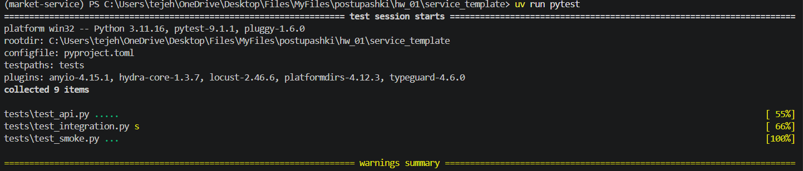
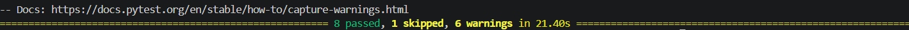
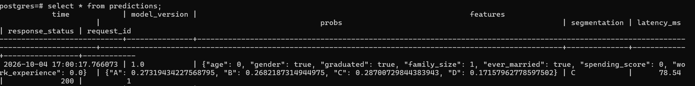
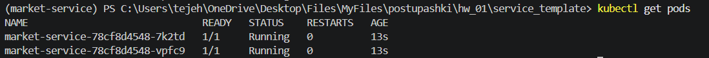
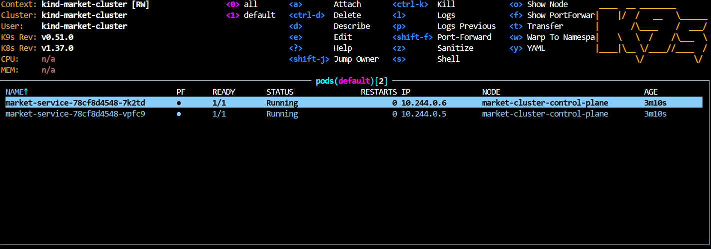
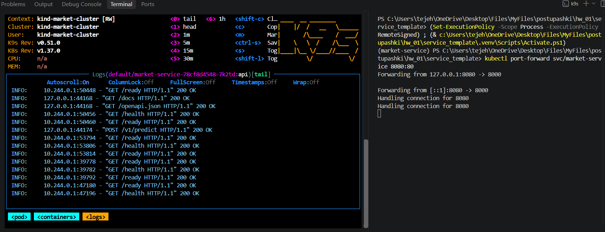

# service_template
# Команды:

0) uv sync

1) uv run pytest

2) docker compose -f compose.yaml up -d

3) * kind create cluster --name market-cluster 
* kind load docker-image market-service:v1 --name market-cluster
* kubectl apply -f k8s/
* Запуск в отдельном терминале тунель: kubectl port-forward svc/market-service 8080:80
* kubectl get pods 

# Скрины:

